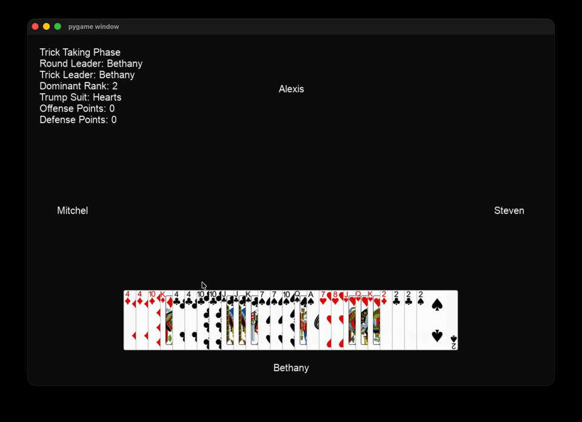
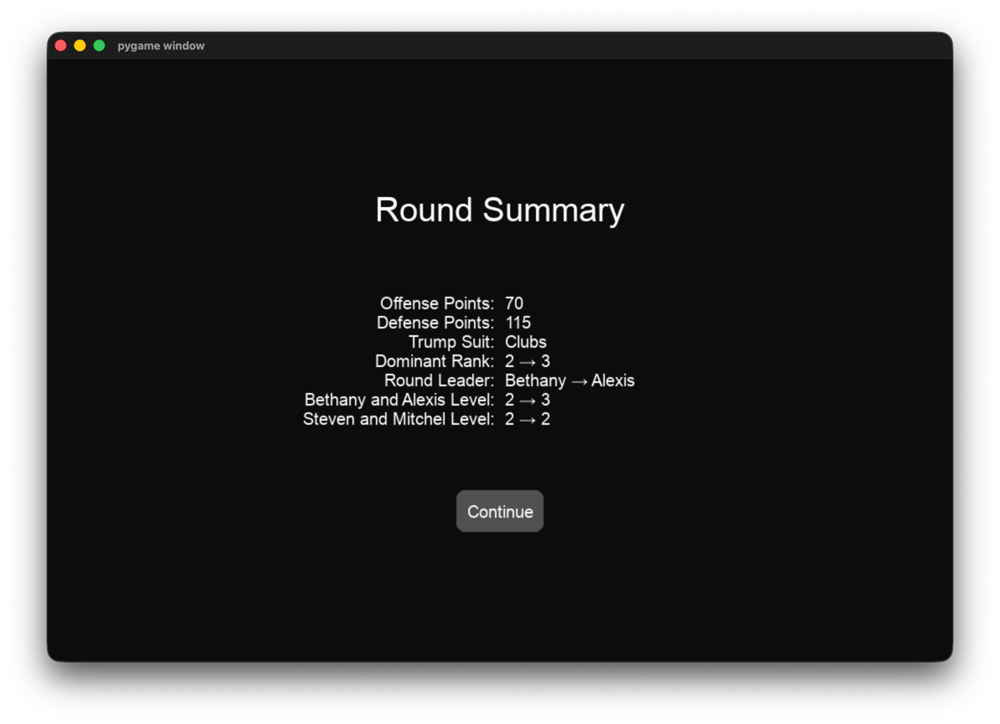
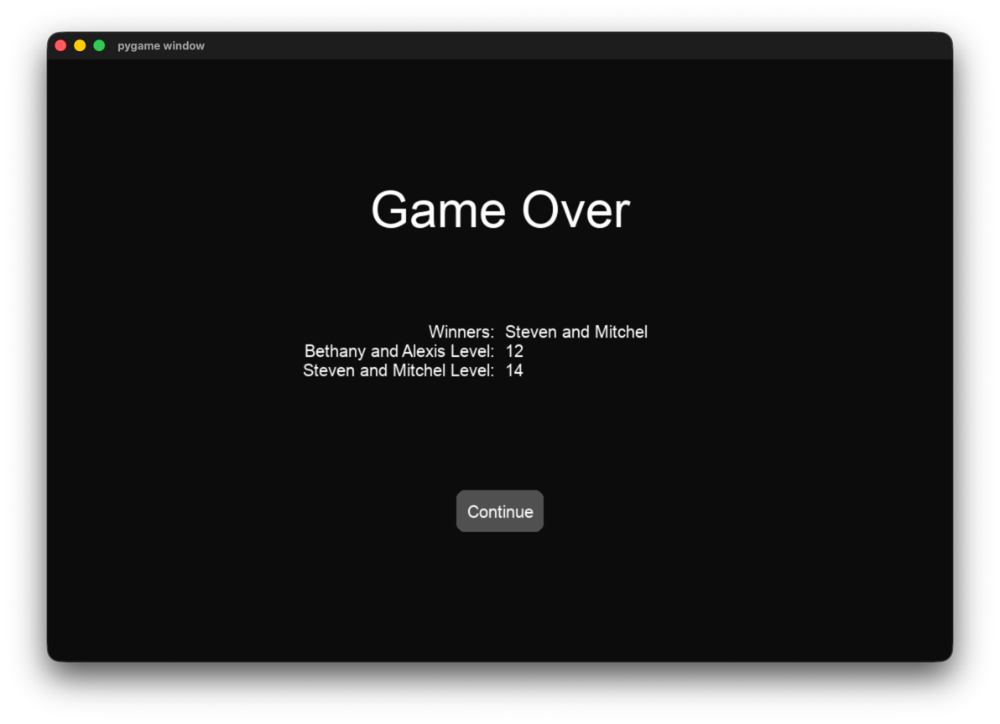

# Tractor AI

## About Tractor

Tractor (AKA Upgrade/Shengji/升级) is a popular Chinese trick-taking card game. There are many
variants of the game, but the main rules are similar. Go to the
[Wikipedia article](https://en.wikipedia.org/wiki/Sheng_ji) for more information about the game's
rules.

## About This Project

This project is a playable desktop implementation of Tractor written in Python. Prebuilt binaries
are available for Windows, macOS, and Linux. You can jump straight to the installation instructions
[here](#installation). Multi-combination throws (甩牌) are not currently supported. The long-term
goal is to train a machine learning model to play Tractor.

## Features

* Interactive GUI
* Cross-platform builds (Windows, macOS, Linux)
* Player hand hiding for pass-and-play
* Core game flow (drawing, bidding, kitty, trick-taking, scoring)
* Single, pair, tractor, and consecutive pair trick types
* Legal move generation
* Round summary when transitioning rounds
* Player name customization
* Automatic pass mode (during drawing/bidding phase)
* Game over screen

### Gameplay

### Round Summary

### Game Over Screen

## Installation

Follow the steps below to download and run the project on your operating system.

### Windows

Go to the [releases page](https://github.com/GoldenElf58/tractor-ai/releases). Download
`tractor-ai-windows.zip`, extract it, open the `tractor-ai-windows` folder, and run
`tractor-ai-windows.exe`. You're good to go!

### macOS

Go to the [releases page](https://github.com/GoldenElf58/tractor-ai/releases) and download
`tractor-ai-macos.zip`. **Only Apply Silicon (M1/M2/M3...) Macs are currently supported.** Extract
the zip file and run `tractor-ai-macos`. If you get a message that says "Apple could not verify
“tractor-ai-macos” is free of malware that may harm your Mac or compromise your privacy," click "
Done". Go to System Settings/Privacy & Security and scroll down to the Security section. Click "Open
Anyway" next to the message that says "tractor-ai-macos was blocked to protect your app". Click "
Open Anyway" one more time, then type in your password. You're good to go!

### Linux

Go to the [releases page](https://github.com/GoldenElf58/tractor-ai/releases) and download
`tractor-ai-linux.zip`. Extract the zip file, open the `tractor-ai-linux` folder, and run
`tractor-ai-linux` (in the folder). You're good to go!

## How To Play

This is currently a pass-and-play style game, so after taking a turn, you can pass the computer to
the next player for them to take their turn.

### Drawing/Bidding Phase

On your turn, you can always select the "Pass" button to pass the bid. If you want to bid, select
the card in your hand you want to bid and press the "Bid" button. Since this phase has a lot of
passing turns, you can also press the "Auto" button to automatically pass the bid if that is your
only play.

### Burying/Kitty Phase

Select the eight cards from your hand you would like to bury and press the "Discard" button to
confirm.

### Trick-Taking Phase

Select the card, pair, or consecutive pair you want to play and press the "Play" button.
